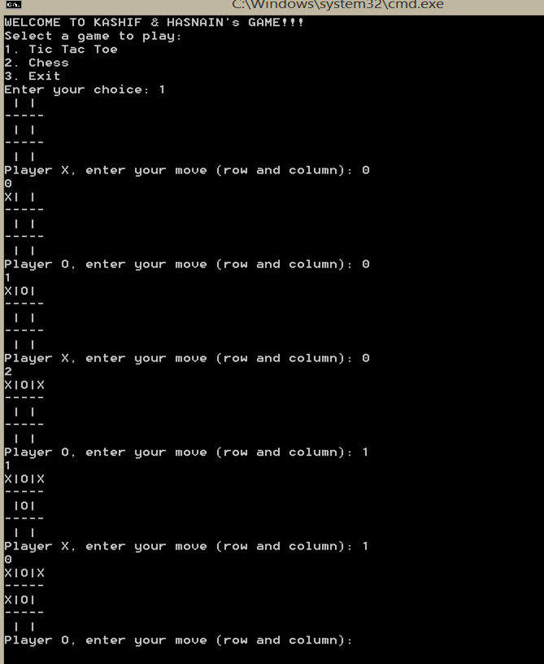
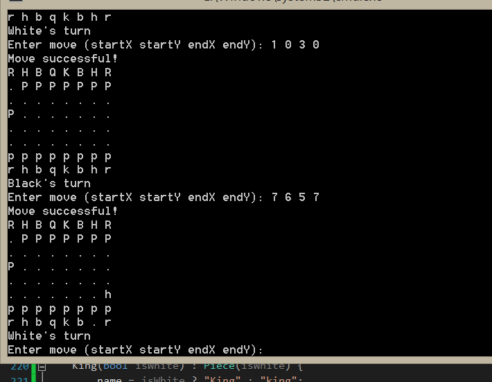

# checkmate-and-crosses
A modular console gaming application featuring Chess and Tic-Tac-Toe.

Overview:
    This project is a game containing two mini games i.e chess and tic-tac toe. Various concepts of data structure and object oriented programming have been used for example classes, polymorphism, inheritance etc. 

Concepts of DS&OOP used in the project:

•	Classes and Objects:
o	The code defines multiple classes (e.g., TicTacToe, Piece, Board, Pawn, Rook, etc.). Each class encapsulates properties and methods related to a specific entity in the game.
o	Objects of these classes are created to simulate a game, such as creating an object of TicTacToe or Board to represent the game state.

•	Encapsulation:
o	Data is encapsulated within classes, making it private (e.g., board, currentPlayer in the TicTacToe class).
o	Methods like makeMove, display, and switchPlayer allow interaction with the internal state of the class.

•	Inheritance:
o	The Piece class is a base class for all the different types of chess pieces (Pawn, Rook, Knight, Bishop, Queen, King), demonstrating inheritance. These derived classes inherit the common interface (isValidMove) from the Piece class but also have their own specific implementations.
o	This promotes code reuse and allows different pieces to share common functionality while maintaining flexibility.

•	Polymorphism:
o	The method isValidMove is overridden in the derived classes (e.g., Pawn, Rook, Knight). Each piece has its own specific implementation of how it validates a move.
o	The Piece pointer is used in the chessboard array (Piece* board[BOARD_SIZE][BOARD_SIZE]), allowing each square to hold any type of piece, and the program can call isValidMove polymorphically (i.e., it calls the version of isValidMove that corresponds to the actual piece).

•	Virtual Functions:
o	The isValidMove function is declared as a pure virtual function in the Piece class. This enforces that each derived class (like Pawn, Rook, etc.) must implement its own version of the isValidMove method.
o	This is an example of abstract classes (classes with pure virtual functions).

•	Constructor and Destructor:
o	The constructor initializes the game state TicTacToe() constructor initializes the board and sets the starting player).
o	The Board class has a destructor that cleans up dynamically allocated memory for the chess pieces.

•	Arrays:
o	A 2D array board[size][size] is used in TicTacToe to represent the game board.
o	In Board, a 2D array board[BOARD_SIZE][BOARD_SIZE] holds pointers to Piece objects, allowing for an 8x8 chessboard.

•	Pointers:
o	Pointers are used extensively, especially in the Board class, where Piece* pointers are used to manage dynamically allocated memory for chess pieces.
o	The Piece* array allows you to store different types of chess pieces (like Pawn, Rook, etc.) in the same array.

•	Dynamic Memory Allocation:
o	Chess pieces are dynamically allocated using new (e.g., board[1][i] = new Pawn(true);) and deallocated using delete (in the Board destructor).

•	Loops:
o	For loops (for) are used to iterate through the rows and columns of the boards, in both Tic Tac Toe and Chess games, to print or update the game board.
o	While loops (while) control the main game loops. For example, in the playTicTacToe() method, the game continues as long as the game is ongoing or the player chooses to play another round.

•	Conditionals:
o	If-else statements check various conditions like whether a move is valid (if (board[x][y] != nullptr)), whether the game is over, or whether the board is full.
o	In Tic Tac Toe, conditions check if the current player has won or if there is a draw (checkWin, isBoardFull).
o	Chess move validation checks if the move is within bounds, whether a piece is moving in a valid pattern, etc.

•	Function Overloading:
o	In the chess game, isValidMove() is overloaded in each piece class (e.g., Rook, Pawn, Queen, etc.). Although the function name is the same, its behavior differs based on the type of piece.

•	Error Handling:
o	The program checks for invalid moves or actions (e.g., trying to move a piece out of bounds or to an occupied square).

Working of the games:

•	Tic-Tac-Toe:
                A TicTacToe class implements the functionality for the classic 3x3 Tic Tac Toe game.
o	The display() function renders the game board.
o	The makeMove() function allows players to place their mark (either 'X' or 'O') on the board.
o	The checkWin() function checks if either player has won after each move.
o	The isBoardFull() function checks if the board is full, resulting in a draw.
o	The switchPlayer() function alternates between players.

•	Chess:
        The chess game is implemented using a base class Piece and derived classes for each type of chess piece (Pawn, Rook, Knight, Bishop, Queen, and King).
o	Each piece has an isValidMove() function that checks if a move is valid based on its movement rules.
o	The chessboard is an 8x8 grid of Piece* pointers, where each piece is dynamically allocated.
o	The Board class manages the chessboard setup and the validation of moves.
o	The GameMenu class provides the game selection interface and invokes either the Tic Tac Toe or Chess game.

Solution:

